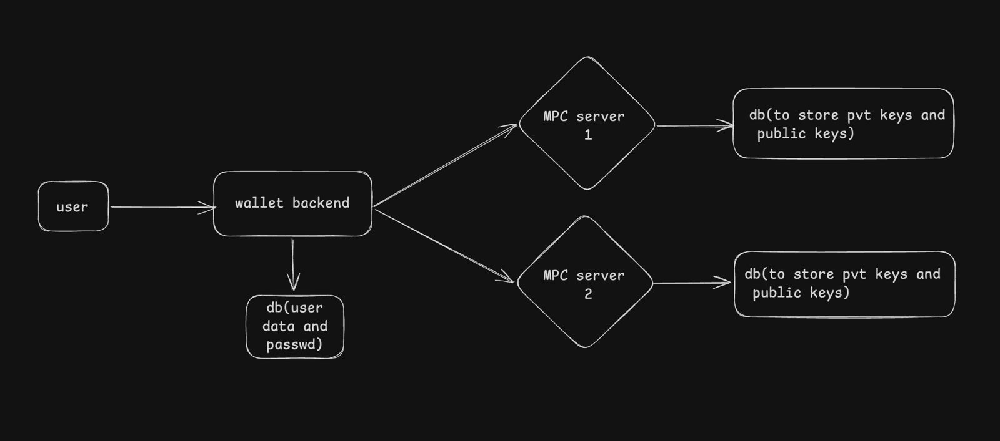
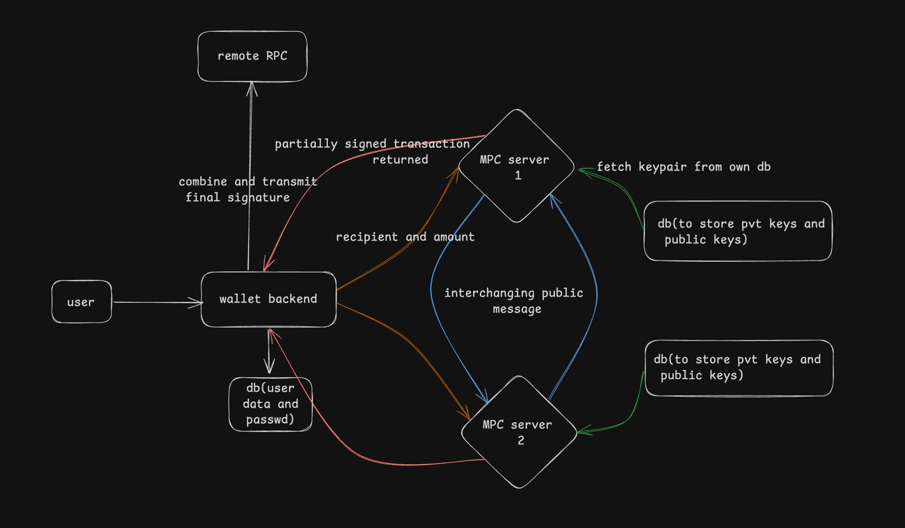

# Shardo - Solana Transaction Manager

A full-stack web application for managing Solana transactions with secure authentication and advanced private key management using distributed MPC-TSS (Multi-Party Computation Threshold Signature Scheme). Shardo's core USP is its robust, offchain, collaborative signing process—private keys are never fully reconstructed or stored in one place, ensuring maximum security.

## Demo

[![Watch the demo]](https://www.youtube.com/watch?v=V6AOTw1A7yI&ab_channel=seriousperson)

---

## Key Features
- Secure user authentication (JWT, strong password requirements)
- **Advanced private key management using distributed MPC-TSS**: All signing operations require collaboration between multiple servers, and private keys are never fully reconstructed or exposed
- Send SOL to any Solana address with real-time status
- Transaction signing using distributed MPC (n-of-n offchain multisig)
- Modern, responsive UI/UX
- Devnet integration for safe testing

## System Architecture

Below are diagrams illustrating the architecture and flow of the Shardo Solana Transaction Manager:


### Key Management Overview



### Full Signing Flow



---

## Tech Stack

### Frontend
- React.js
- React Router for navigation
- Tailwind CSS for styling
- Axios for API requests
- @solana/web3.js for Solana integration

### Backend
- Node.js with Express
- MongoDB for data storage
- JWT for authentication
- @solana/web3.js for blockchain interaction
- Zod for request validation
- **TSS/MPC via Rust CLI** (see below)

### Utilities (Private Key Management & TSS)
- TypeScript wrappers for the `solana-tss` Rust CLI
- Provides async functions for:
  - Key share generation
  - Key aggregation
  - Distributed signing (agg-send-step-one, agg-send-step-two)
  - Signature aggregation and transaction broadcasting
- CLI binary must be available in your PATH or configured via environment variable

## Prerequisites

- Node.js (v14 or higher)
- MongoDB (running locally or connection string)
- npm or yarn package manager
- **Rust toolchain** (for building the TSS CLI)
- **Solana TSS CLI** (`solana-tss` binary, see below)

## Setting Up the Solana TSS CLI

1. Clone the open-source Solana TSS implementation:
   ```bash
   git clone <solana-tss-repo-url>
   cd solana-tss
   cargo build --release
   cp target/release/solana-tss /usr/local/bin/
   # Or set the path in your environment
   export SOLANA_TSS_CLI_PATH=/path/to/solana-tss
   ```
2. Ensure the binary is available in your PATH or configure the path in the utilities package.

## Local Setup

1. Clone the repository:
```bash
git clone <repository-url>
cd shardo
```

2. Install dependencies for both frontend and backend:
```bash
# Install backend dependencies
cd backend
npm install

# Install frontend dependencies
cd ../client
npm install
```

3. Set up environment variables:

Create a `.env` file in the backend directory:
```env
PORT=3000
MONGODB_URI=mongodb://localhost:27017/cloudapp
JWT_SECRET=your_jwt_secret
SOLANA_RPC_URL=https://api.devnet.solana.com
```

4. Start MongoDB:
```bash
# If using local MongoDB
mongod
```

5. Start the backend server:
```bash
cd backend
npm run dev
```

6. Start the frontend development server:
```bash
cd client
npm run dev
```

The application should now be running at:
- Frontend: http://localhost:5173
- Backend: http://localhost:3000

---

## Running the MPC Servers

Shardo uses two MPC servers to simulate distributed key management and collaborative signing. Each server holds a share of the private key and must participate in every signing operation (n-of-n scheme).

To start both MPC servers, open two separate terminal windows/tabs and run:

### Start MPC Server 1
```bash
cd mpc-server-1
npm install # if not already done
npm start
```

### Start MPC Server 2 (mpc-server-3)
```bash
cd mpc-server-3
npm install # if not already done
npm start
```

Both servers will listen for signing requests from the wallet backend and communicate as part of the offchain multisignature process. If either server is down, transaction signing will not proceed.

---

## Usage

1. Register a new account at `/signup`
2. Sign in with your credentials at `/signin`
3. Access the dashboard at `/dashboard`
4. Enter recipient address and amount to send SOL
5. Confirm and sign the transaction (using TSS/MPC flows)

## API Endpoints

### Authentication
- `POST /api/v1/signup` - Register new user
- `POST /api/v1/signin` - User login

### Transactions
- `POST /api/v1/txn/sign` - Sign and send transaction (TSS-based)

## Development

### Project Structure
```
shardo/
├── client/
│   ├── public/
│   ├── src/
│   │   ├── assets/
│   │   ├── components/
│   │   ├── content/
│   │   ├── context/
│   │   ├── App.jsx
│   │   ├── App.css
│   │   └── main.jsx
│   ├── package.json
│   └── ...
├── server/
│   ├── src/
│   │   ├── middleware/
│   │   ├── models/
│   │   ├── services/
│   │   └── app.js
│   ├── package.json
│   └── ...
├── mpc-server-1/
│   ├── index.js
│   ├── middleware/
│   ├── models/
│   ├── package.json
│   └── ...
├── mpc-server-3/
│   ├── index.js
│   ├── middleware/
│   ├── models/
│   ├── package.json
│   └── ...
├── utilities/
│   ├── src/
│   │   ├── commands/
│   │   ├── core/
│   │   ├── services/
│   │   ├── types/
│   ├── package.json
│   └── ...
├── README.md
├── package.json
└── ...
```

## About the TSS Implementation: n-of-n Offchain Multisignature

While Shardo uses a distributed signing process inspired by Threshold Signature Schemes (TSS), it is important to clarify that the current implementation is an **n-of-n offchain multisignature** system, not a true TSS.

- **n-of-n Offchain Multisig:** All `n` MPC servers must participate in every signing operation. If any server is unavailable, the signature cannot be produced. The private key is never reconstructed, and all signing is done collaboratively offchain.
- **True TSS:** In a true `(t, n)` TSS, any `t` out of `n` parties can produce a valid signature, providing fault tolerance and flexibility. The private key is never reconstructed, and no single party ever has access to the full key.

**Summary:**  
Shardo's approach increases security by distributing key shares and requiring all parties to cooperate, but it does not provide the threshold flexibility of a true TSS. This is sometimes called "n-of-n TSS" or "offchain multisig," and is a strong security model, but not a full threshold scheme.

For more details, see the [solana-tss documentation](https://github.com/your-solana-tss-repo) and the `utilities/src/services/tss-service.ts` file.